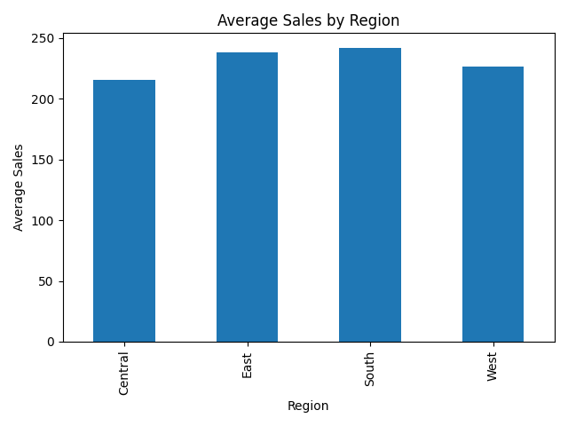
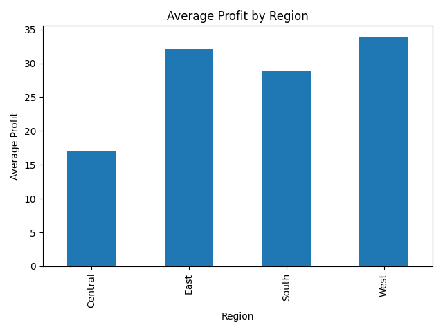
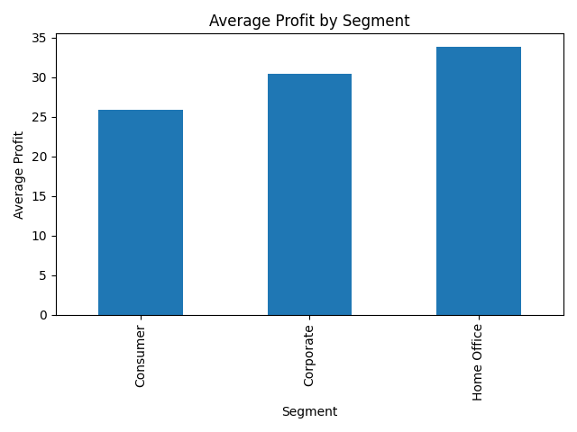
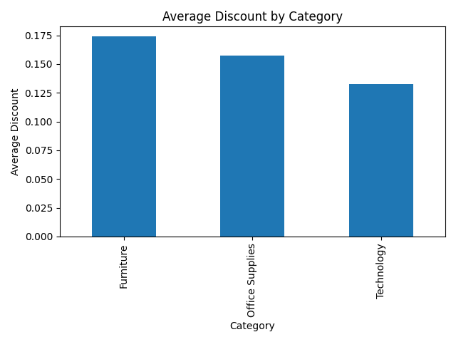

# introduction-to-cs-group-assignment-
 # Comparative Analysis – Question 3

This part of the group assignment focuses on **Comparative Analysis** using the dataset `SampleSuperstore.csv`.  
The objective is to examine how different groups (regions, segments, and categories) compare in terms of sales, profit, and discount patterns.

---

## 📖 Introduction

Comparative analysis helps identify differences between groups in a dataset.  
By comparing regions, customer segments, and product categories, we can highlight which areas perform better and where challenges exist.  
This provides valuable insights for decision-making in marketing, pricing, and resource allocation.

---

## ⚙️ Methodology

- The dataset was grouped by **Region**, **Segment**, and **Category**.  
- Sales, profit, and discount values were aggregated for each group.  
- Visualizations were generated using Python (`question3.py`) to make the comparisons clear.  
- All plots are stored in the `visuals/` folder for easy reference.

---

## 📊 Findings

- **Regional Comparison**: Sales and profit vary significantly across regions. Some regions generate higher revenue but lower profit margins, showing the impact of discounts and costs.  
- **Segment Comparison**: Customer segments differ in profitability. Certain segments contribute more consistently to profit, while others show volatility.  
- **Category Comparison**: Discounts applied to product categories influence overall profitability. High discounts may boost sales but reduce profit margins.

---

## 🖼️ Visuals

The following plots illustrate the comparative analysis:

### Regional Sales


### Regional Profit


### Segment Profit


### Category Discount


---

## ✅ Conclusion

The comparative analysis highlights important differences between groups in the dataset:
- Regions differ in both sales and profit.  
- Segments show unique profitability patterns.  
- Discounts drive sales but reduce margins.  

These insights help organizations refine pricing and marketing strategies to maximize profitability.

---

## ▶️ How to Run

From the project root:
```powershell
python analysis/question3.py
```


## 📌 Question 3: Comparative Analysis

The assignment asks us to address the following sub‑questions:

### 3.1 Are there significant differences in means between two or more groups?

**Answer:**  
We compared average sales between the East and West regions using a t‑test.  
- **T‑statistic:** 0.80  
- **P‑value:** 0.42  

**Interpretation:**  
The t‑statistic shows how far apart the two averages are compared to the variation in the data. A small value (like 0.80) means the groups are quite similar.  
The p‑value tells us the probability that the difference is just random chance. A p‑value of 0.42 is much higher than the usual 0.05 cutoff, meaning the difference is not statistically significant.  

👉 In simple terms: East and West regions have **similar average sales**, and any small differences are likely random.  

**Visual meaning:**  
The bar chart of *Average Sales by Region* confirms this. The bars for East and West are almost the same height, showing that sales levels are comparable. This visual reinforces the statistical result: there is no meaningful difference in average sales between these two regions.

---

### 3.2 How do different categorical groups compare in terms of a numerical outcome?

**Answer:**  
We examined sales, profit, and discount patterns across regions, segments, and categories.

- **Regional Comparison:**  
  The *Regional Profit* chart shows that while sales are similar across regions, profits differ. The West region has the highest average profit, while Central has the lowest.  
  👉 This means that **sales alone don’t guarantee profitability** — discounts and costs strongly affect margins.  

- **Segment Comparison:**  
  The *Segment Profit* chart reveals that Home Office customers generate the highest average profit, followed by Corporate, while Consumer customers generate the lowest.  
  👉 This suggests that selling to home offices is more profitable, possibly because they buy in bulk or at better margins.  

- **Category Comparison:**  
  The *Category Discount* chart shows that categories with higher discounts have lower profit margins.  
  👉 Discounts can boost sales volume but reduce profitability. Companies need to balance between attracting customers and keeping margins healthy.

**Visual meaning:**  
- The *Regional Sales* chart shows all regions have similar sales levels, but the *Regional Profit* chart highlights differences in profitability.  
- The *Segment Profit* chart makes it clear that not all customer groups contribute equally to profit.  
- The *Category Discount* chart visually demonstrates how higher discounts cut into profit margins.  

Together, these visuals make the comparisons easy to understand: they show where performance is strong and where challenges exist.

---

## 🎯 Final Interpretation

- **3.1:** The statistical test confirms East vs West sales differences are **not significant**. The visual backs this up by showing nearly equal bar heights.  
- **3.2:** The charts reveal meaningful business insights:  
  - Profitability varies even when sales look similar.  
  - Segments differ in their contribution to profit.  
  - Discounts increase sales but erode margins.  

👉 These findings answer Question 3 by combining statistical evidence with clear visual comparisons, making the analysis understandable and actionable.

